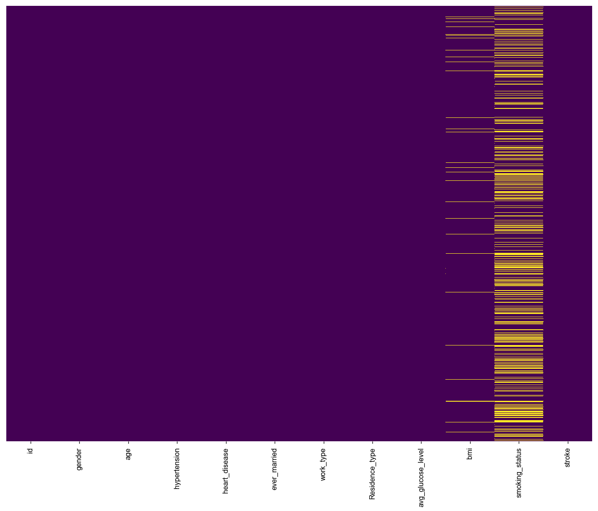
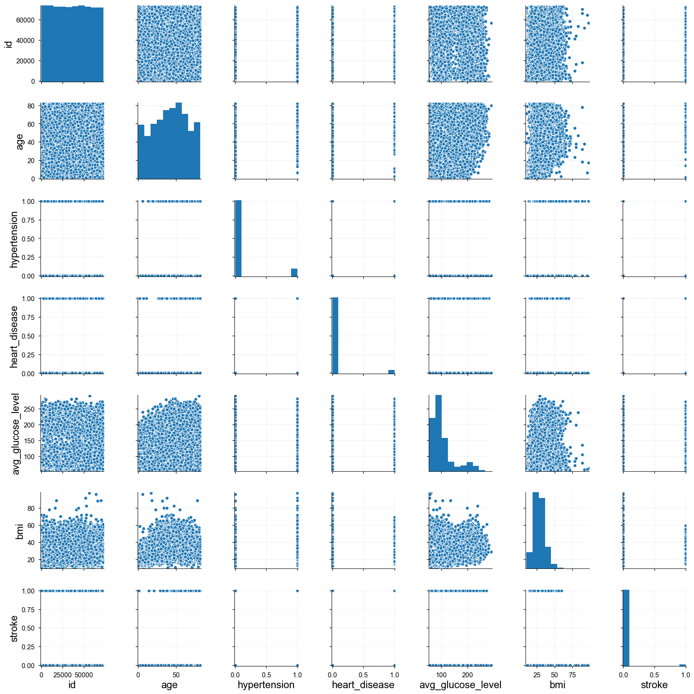
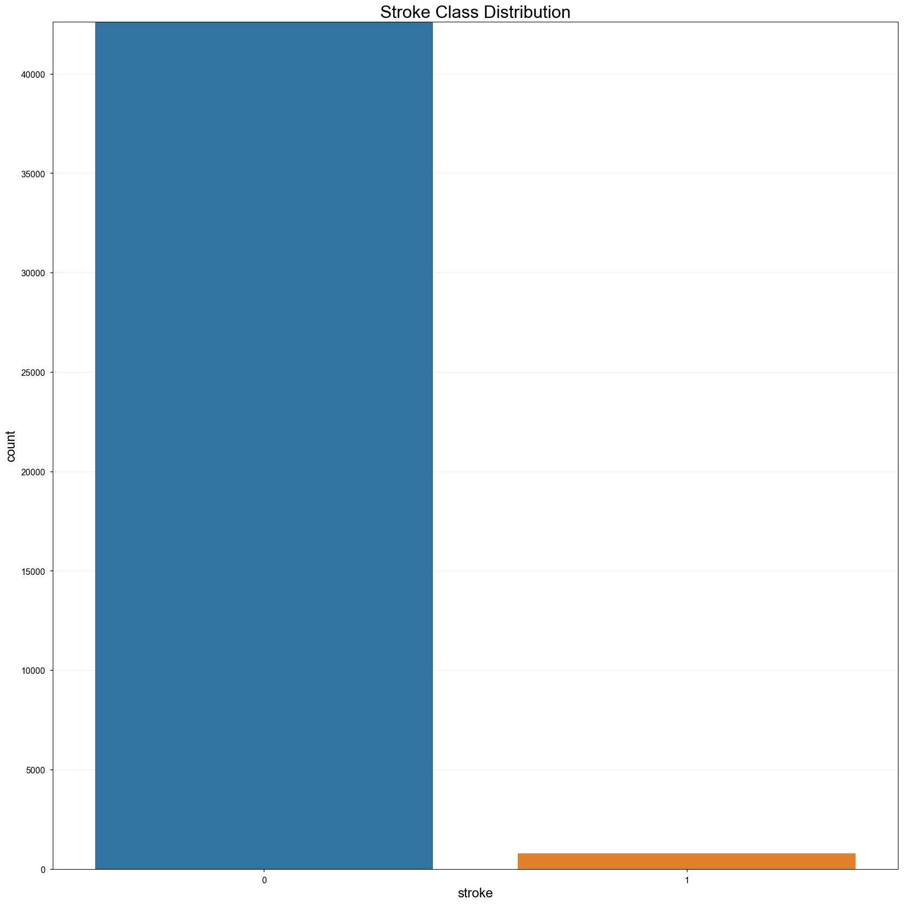
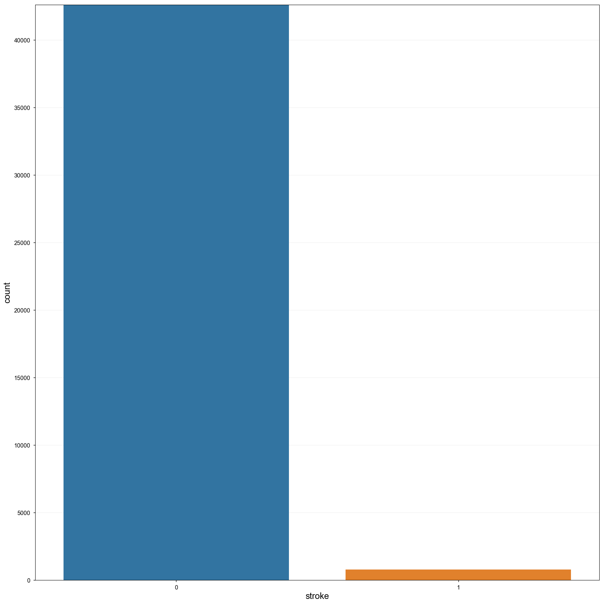
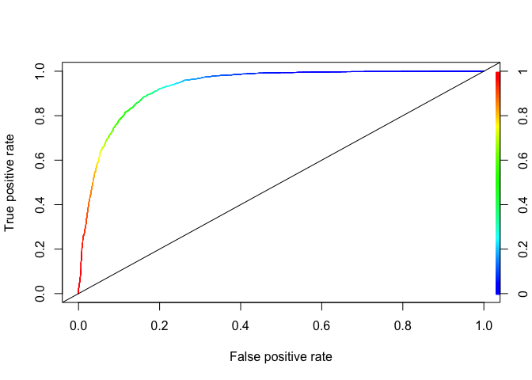
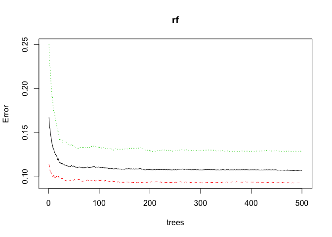
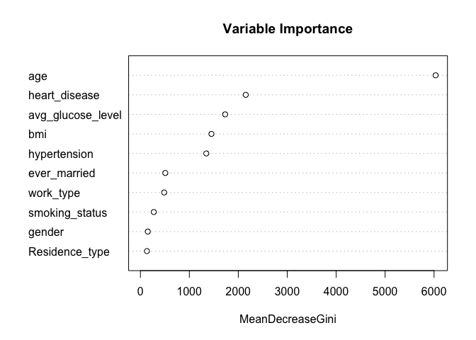
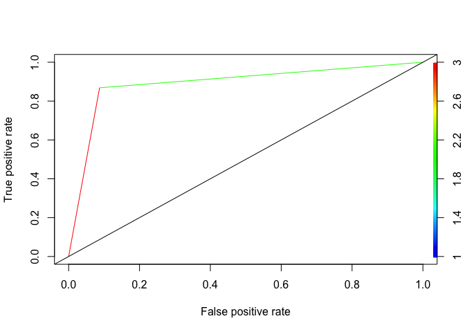

Stroke Clinical Predictive Model
================
Tosin Dairo
MAY 25, 2019

## Clinical Predictive Model classifier for stroke

Stroke-CPM is a tool that takes information available about a patient
and their observed predictive factors, and makes a prediction regarding
their diagnosis and causal factors.

  - Diagnosis – detects presence of stroke currently
  - Causal Factors – assess whether observed predictive factor(s) is/are
    likely to be contributors to the development of stroke presently or
    in the future

<br></br>

#### Observed Factors:

  - Gender
  - Age
  - Hypertension
  - Heart Disease
  - Ever Married
  - Work Type
  - Residence Type
  - Average Glucose Level
  - BMI
  - Smoking Status

<br></br>

``` r
#
# init.R
# Stroke-CPM
#
# Created by Tosin-Dairo on 28/03/2020
# MIT License
#

my_packages = c("rmarkdown","httr", "reticulate", "tidyverse", "mice", "MASS", "sjPlot", "dataPreparation", "DMwR", "randomForest", "caret", "pROC", "ROCR", "ResourceSelection","devtools")


install_if_missing = function(p) {
  if (p %in% rownames(installed.packages()) == FALSE) {
    install.packages(p)
  }
}

invisible(sapply(my_packages, install_if_missing))
# install pool from Github
invisible(devtools::install_github("rstudio/pool"))
```

    ## Skipping install of 'pool' from a github remote, the SHA1 (0b03680b) has not changed since last install.
    ##   Use `force = TRUE` to force installation

``` r
head(d)
```

    ##      id gender age hypertension heart_disease ever_married    work_type
    ## 1 30669   Male   3            0             0           No     children
    ## 2 30468   Male  58            1             0          Yes      Private
    ## 3 16523 Female   8            0             0           No      Private
    ## 4 56543 Female  70            0             0          Yes      Private
    ## 5 46136   Male  14            0             0           No Never_worked
    ## 6 32257 Female  47            0             0          Yes      Private
    ##   Residence_type avg_glucose_level  bmi  smoking_status stroke
    ## 1          Rural             95.12 18.0                      0
    ## 2          Urban             87.96 39.2    never smoked      0
    ## 3          Urban            110.89 17.6                      0
    ## 4          Rural             69.04 35.9 formerly smoked      0
    ## 5          Rural            161.28 19.1                      0
    ## 6          Urban            210.95 50.1                      0

#### Missing Values

``` r
d$smoking_status <- na_if(d$smoking_status, "")
```

``` python
print(r.d.isnull().sum())
```

    ## id                       0
    ## gender                   0
    ## age                      0
    ## hypertension             0
    ## heart_disease            0
    ## ever_married             0
    ## work_type                0
    ## Residence_type           0
    ## avg_glucose_level        0
    ## bmi                   1462
    ## smoking_status       13292
    ## stroke                   0
    ## dtype: int64

``` python
fig, ax = plt.subplots(figsize=(14,12))
sns.heatmap(r.d.isnull(),yticklabels=False,cbar=False,cmap='viridis') 
```

<!-- -->

``` r
d$gender <- as.factor(d$gender)
d$ever_married <- as.factor(d$ever_married)
d$work_type <- as.factor(d$work_type)
d$Residence_type <- as.factor(d$Residence_type)
d$smoking_status <- as.factor(d$smoking_status)
str(d)
```

    ## 'data.frame':    43400 obs. of  12 variables:
    ##  $ id               : int  30669 30468 16523 56543 46136 32257 52800 41413 15266 28674 ...
    ##  $ gender           : Factor w/ 3 levels "Female","Male",..: 2 2 1 1 2 1 1 1 1 1 ...
    ##  $ age              : num  3 58 8 70 14 47 52 75 32 74 ...
    ##  $ hypertension     : int  0 1 0 0 0 0 0 0 0 1 ...
    ##  $ heart_disease    : int  0 0 0 0 0 0 0 1 0 0 ...
    ##  $ ever_married     : Factor w/ 2 levels "No","Yes": 1 2 1 2 1 2 2 2 2 2 ...
    ##  $ work_type        : Factor w/ 5 levels "children","Govt_job",..: 1 4 4 4 3 4 4 5 4 5 ...
    ##  $ Residence_type   : Factor w/ 2 levels "Rural","Urban": 1 2 2 1 1 2 2 1 1 2 ...
    ##  $ avg_glucose_level: num  95.1 88 110.9 69 161.3 ...
    ##  $ bmi              : num  18 39.2 17.6 35.9 19.1 50.1 17.7 27 32.3 54.6 ...
    ##  $ smoking_status   : Factor w/ 4 levels "","formerly smoked",..: NA 3 NA 2 NA NA 2 3 4 3 ...
    ##  $ stroke           : int  0 0 0 0 0 0 0 0 0 0 ...

#### Multiple Imputation for Missing Data

> Using Predictive Mean Matching and Poly Regreession Technique

``` r
imp <- mice(d, seed = 3333)
```

    ## 
    ##  iter imp variable
    ##   1   1  bmi  smoking_status
    ##   1   2  bmi  smoking_status
    ##   1   3  bmi  smoking_status
    ##   1   4  bmi  smoking_status
    ##   1   5  bmi  smoking_status
    ##   2   1  bmi  smoking_status
    ##   2   2  bmi  smoking_status
    ##   2   3  bmi  smoking_status
    ##   2   4  bmi  smoking_status
    ##   2   5  bmi  smoking_status
    ##   3   1  bmi  smoking_status
    ##   3   2  bmi  smoking_status
    ##   3   3  bmi  smoking_status
    ##   3   4  bmi  smoking_status
    ##   3   5  bmi  smoking_status
    ##   4   1  bmi  smoking_status
    ##   4   2  bmi  smoking_status
    ##   4   3  bmi  smoking_status
    ##   4   4  bmi  smoking_status
    ##   4   5  bmi  smoking_status
    ##   5   1  bmi  smoking_status
    ##   5   2  bmi  smoking_status
    ##   5   3  bmi  smoking_status
    ##   5   4  bmi  smoking_status
    ##   5   5  bmi  smoking_status

    ## Warning: Number of logged events: 25

``` r
imp$method
```

    ##                id            gender               age      hypertension 
    ##                ""                ""                ""                "" 
    ##     heart_disease      ever_married         work_type    Residence_type 
    ##                ""                ""                ""                "" 
    ## avg_glucose_level               bmi    smoking_status            stroke 
    ##                ""             "pmm"         "polyreg"                ""

``` r
dx <- mice::complete(imp)
```

``` python
print(r.dx.isnull().sum())
```

    ## id                   0
    ## gender               0
    ## age                  0
    ## hypertension         0
    ## heart_disease        0
    ## ever_married         0
    ## work_type            0
    ## Residence_type       0
    ## avg_glucose_level    0
    ## bmi                  0
    ## smoking_status       0
    ## stroke               0
    ## dtype: int64

``` python
fig, ax = plt.subplots(figsize=(14,12))
sns.heatmap(r.dx.isnull(),yticklabels=False,cbar=False,cmap='viridis') 
```

<!-- -->

#### Exploratory Analysis

``` python
fig, ax = plt.subplots(figsize=(14,12))
sns.pairplot(r.dx)
```

    ## <seaborn.axisgrid.PairGrid object at 0x139d035c0>

``` python
plt.show()
```

    ## /Volumes/Loopdisk/Dev/PyDsc/env/lib/python3.6/site-packages/matplotlib/figure.py:2299: UserWarning: This figure includes Axes that are not compatible with tight_layout, so results might be incorrect.
    ##   warnings.warn("This figure includes Axes that are not compatible "

<!-- -->

``` python
sns.countplot(x='stroke', data = r.dx)
```

<!-- -->

``` r
#
# label_encode.R
# Stroke-CPM
#
# Created by Tosin-Dairo on 28/03/2020
# MIT License
#
```

``` r
encode.fit_transform<-function(df, plug_missing=TRUE){
  
  list_of_levels=list()  #empty list   
  
  #loop through the columns
  for (i in 1: ncol(df))
  {
    
    #only   
    if (is.character(df[,i]) ||  is.factor(df[,i]) ){
      
      #deal with missing
      if(plug_missing){
        
        #if factor
        if (is.factor(df[,i])){
          df[,i] = factor(df[,i], levels=c(levels(df[,i]), 'MISSING'))
          df[,i][is.na(df[,i])] = 'MISSING' 
          
          
        }else{   #if character
          
          df[,i][is.na(df[,i])] = 'MISSING' 
          
        }
      }#end missing IF
      
      levels<-unique(df[,i]) #distinct levels
      list_of_levels[[colnames(df)[i]]] <- levels #set list with name of the columns to the levels
      df[,i] <- as.numeric(factor(df[,i], levels = levels))
      
    }#end if character/factor IF
    
    
  }#end loop
  
  return (list(list_of_levels,df)) #return the list of levels and the new DF
  
}#end of function
```

``` r
encode.transform<-function(df,list_of_levels,plug_missing=TRUE)
{
  #loop through the columns
  for (i in 1: ncol(df))
  {
    
    #only   
    if (is.character(df[,i]) ||  is.factor(df[,i]) ){
      
      
      #deal with missing
      if(plug_missing){
        
        #if factor
        if (is.factor(df[,i])){
          df[,i] = factor(df[,i], levels=c(levels(df[,i]), 'MISSING'))
          df[,i][is.na(df[,i])] = 'MISSING' 
          
          
        }else{   #if character
          
          df[,i][is.na(df[,i])] = 'MISSING' 
          
        }
      }#end missing IF
      
      levels=list_of_levels[[colnames(df)[i]]]
      
      if (! is.null(levels)){
        df[,i] <- as.numeric(factor(df[,i], levels = levels))
      }
      
    }# character or factor
    
  }#end of loop
  
  return(df)
  
}#end of function
```

``` r
result <- encode.fit_transform(dx)

dx_ <- result[[2]]
# encode.transform()
```

``` r
tab_df(table(dx_$stroke), title = "Stroke Class")
```

<table style="border-collapse:collapse; border:none;">

<caption style="font-weight: bold; text-align:left;">

Stroke
Class

</caption>

<tr>

<th style="border-top: double; text-align:center; font-style:italic; font-weight:normal; padding:0.2cm; border-bottom:1px solid black; text-align:left; ">

0

</th>

<th style="border-top: double; text-align:center; font-style:italic; font-weight:normal; padding:0.2cm; border-bottom:1px solid black; ">

1

</th>

</tr>

<tr>

<td style=" padding:0.2cm; text-align:left; vertical-align:top; text-align:left; border-bottom: double; modelcolumn0 ">

42617

</td>

<td style=" padding:0.2cm; text-align:left; vertical-align:top; text-align:center; border-bottom: double;  ">

783

</td>

</tr>

</table>

``` r
tab_df(table(dx_$hypertension), title = "Hypertension Class")
```

<table style="border-collapse:collapse; border:none;">

<caption style="font-weight: bold; text-align:left;">

Hypertension
Class

</caption>

<tr>

<th style="border-top: double; text-align:center; font-style:italic; font-weight:normal; padding:0.2cm; border-bottom:1px solid black; text-align:left; ">

0

</th>

<th style="border-top: double; text-align:center; font-style:italic; font-weight:normal; padding:0.2cm; border-bottom:1px solid black; ">

1

</th>

</tr>

<tr>

<td style=" padding:0.2cm; text-align:left; vertical-align:top; text-align:left; border-bottom: double; modelcolumn0 ">

39339

</td>

<td style=" padding:0.2cm; text-align:left; vertical-align:top; text-align:center; border-bottom: double;  ">

4061

</td>

</tr>

</table>

``` r
tab_df(table(dx_$heart_disease), title = "Heart Disease Class")
```

<table style="border-collapse:collapse; border:none;">

<caption style="font-weight: bold; text-align:left;">

Heart Disease
Class

</caption>

<tr>

<th style="border-top: double; text-align:center; font-style:italic; font-weight:normal; padding:0.2cm; border-bottom:1px solid black; text-align:left; ">

0

</th>

<th style="border-top: double; text-align:center; font-style:italic; font-weight:normal; padding:0.2cm; border-bottom:1px solid black; ">

1

</th>

</tr>

<tr>

<td style=" padding:0.2cm; text-align:left; vertical-align:top; text-align:left; border-bottom: double; modelcolumn0 ">

41338

</td>

<td style=" padding:0.2cm; text-align:left; vertical-align:top; text-align:center; border-bottom: double;  ">

2062

</td>

</tr>

</table>

``` r
# encoding <- build_encoding(dataSet = X_train, cols = "auto", verbose = TRUE)
# X_train <- one_hot_encoder(dataSet = X_train, encoding = encoding, drop = TRUE, verbose = TRUE)
# X_test <- one_hot_encoder(dataSet = X_test, encoding = encoding, drop = TRUE, verbose = TRUE)
```

``` r
dx_$hypertension <- as.factor(dx_$hypertension)
dx_$heart_disease <- as.factor(dx_$heart_disease)
dx_$stroke <- as.factor(dx_$stroke)
dx_$gender <- as.factor(dx_$gender)
dx_$ever_married <- as.factor(dx_$ever_married)
dx_$work_type <- as.factor(dx_$work_type)
dx_$Residence_type <- as.factor(dx_$Residence_type)
dx_$smoking_status <- as.factor(dx_$smoking_status)
str(dx_)
```

    ## 'data.frame':    43400 obs. of  12 variables:
    ##  $ id               : int  30669 30468 16523 56543 46136 32257 52800 41413 15266 28674 ...
    ##  $ gender           : Factor w/ 3 levels "1","2","3": 1 1 2 2 1 2 2 2 2 2 ...
    ##  $ age              : num  3 58 8 70 14 47 52 75 32 74 ...
    ##  $ hypertension     : Factor w/ 2 levels "0","1": 1 2 1 1 1 1 1 1 1 2 ...
    ##  $ heart_disease    : Factor w/ 2 levels "0","1": 1 1 1 1 1 1 1 2 1 1 ...
    ##  $ ever_married     : Factor w/ 2 levels "1","2": 1 2 1 2 1 2 2 2 2 2 ...
    ##  $ work_type        : Factor w/ 5 levels "1","2","3","4",..: 1 2 2 2 3 2 2 4 2 4 ...
    ##  $ Residence_type   : Factor w/ 2 levels "1","2": 1 2 2 1 1 2 2 1 1 2 ...
    ##  $ avg_glucose_level: num  95.1 88 110.9 69 161.3 ...
    ##  $ bmi              : num  18 39.2 17.6 35.9 19.1 50.1 17.7 27 32.3 54.6 ...
    ##  $ smoking_status   : Factor w/ 3 levels "1","2","3": 1 1 1 2 1 2 2 1 3 1 ...
    ##  $ stroke           : Factor w/ 2 levels "0","1": 1 1 1 1 1 1 1 1 1 1 ...

#### Class Imbalance

``` r
## Smote : Synthetic Minority Oversampling Technique To Handle Class Imbalancy In Binary Classification
# balanced.data <- SMOTE(Class ~., dresstrain, perc.over = 4800, k = 5, perc.under = 1000)
set.seed(3333)

balanced_dx_ <-SMOTE(stroke ~., dx_, perc.over = 2100 , k = 5, perc.under = 160)

tab_df(table(balanced_dx_$stroke), title = "Stroke Class")
```

<table style="border-collapse:collapse; border:none;">

<caption style="font-weight: bold; text-align:left;">

Stroke
Class

</caption>

<tr>

<th style="border-top: double; text-align:center; font-style:italic; font-weight:normal; padding:0.2cm; border-bottom:1px solid black; text-align:left; ">

0

</th>

<th style="border-top: double; text-align:center; font-style:italic; font-weight:normal; padding:0.2cm; border-bottom:1px solid black; ">

1

</th>

</tr>

<tr>

<td style=" padding:0.2cm; text-align:left; vertical-align:top; text-align:left; border-bottom: double; modelcolumn0 ">

26308

</td>

<td style=" padding:0.2cm; text-align:left; vertical-align:top; text-align:center; border-bottom: double;  ">

17226

</td>

</tr>

</table>

### Cross Validation:

The first stage of validation is an internal validation in which we
ensure that the developed CPM makes good predictions in ‘test’ data that
comes from the same population as that in which the CPM was developed.
By ‘good predictions’ we mean predictions that are well calibrated and
have high discrimination. Similar to the discussion in the previous
module on regularised regression (lasso/ridge) a useful way of
performing this is cross validation. Recall that k-fold cross-validation
involves: Dividing the data we have available into k equally sized
groups (commonly we use k between 5 and 10). Fit the CPM using all the
groups except one. Use the remaining group as ‘test’ data to see how the
model performs Repeat this process k times, leaving out a different
group each time. Average performance over these k. A simpler alternative
to cross-validation would just be to divide the data into two groups,
fit the data in one group and validate it in the other. You will
commonly see this in the literature.

``` r
# Random sample indexes
train_index <- sample(1:nrow(balanced_dx_), 0.8 * nrow(balanced_dx_))
test_index <- setdiff(1:nrow(balanced_dx_), train_index)

# Build X_train, y_train, X_test, y_test
X_train <- balanced_dx_[train_index, 2:12]
# y_train <- dx_[train_index, "stroke"]

X_test <- balanced_dx_[test_index, 2:12]
# y_test <- dx_[test_index, "stroke"]

table(X_train$stroke)
```

    ## 
    ##     0     1 
    ## 21000 13827

#### Model Training - Logistic Regression

``` r
# balanced_dx_$hypertension <- as.factor(balanced_dx_$hypertension)
# balanced_dx_$heart_disease <- as.factor(balanced_dx_$heart_disease)
# balanced_dx_$stroke <- as.factor(balanced_dx_$stroke)
# balanced_dx_$gender <- as.factor(balanced_dx_$gender)
# str(balanced_dx_)
set.seed(3333)
model <- glm (stroke ~ ., data=X_train, family = binomial)
summary(model)
```

    ## 
    ## Call:
    ## glm(formula = stroke ~ ., family = binomial, data = X_train)
    ## 
    ## Deviance Residuals: 
    ##     Min       1Q   Median       3Q      Max  
    ## -3.3489  -0.4219  -0.1439   0.4954   3.3973  
    ## 
    ## Coefficients:
    ##                     Estimate Std. Error z value Pr(>|z|)    
    ## (Intercept)       -5.869e+00  2.044e-01 -28.719  < 2e-16 ***
    ## gender2           -2.275e-01  3.339e-02  -6.814  9.5e-12 ***
    ## gender3           -1.279e+01  4.364e+02  -0.029   0.9766    
    ## age                9.552e-02  1.413e-03  67.603  < 2e-16 ***
    ## hypertension1      1.367e+00  3.776e-02  36.210  < 2e-16 ***
    ## heart_disease1     1.827e+00  4.374e-02  41.777  < 2e-16 ***
    ## ever_married2     -1.545e+00  4.510e-02 -34.248  < 2e-16 ***
    ## work_type2        -3.995e-01  2.071e-01  -1.929   0.0537 .  
    ## work_type3        -1.111e+01  8.995e+01  -0.124   0.9017    
    ## work_type4        -6.678e-02  2.097e-01  -0.318   0.7502    
    ## work_type5        -3.317e-02  2.097e-01  -0.158   0.8743    
    ## Residence_type2   -2.896e-02  3.312e-02  -0.874   0.3819    
    ## avg_glucose_level  4.773e-03  3.299e-04  14.471  < 2e-16 ***
    ## bmi               -3.715e-03  2.763e-03  -1.344   0.1788    
    ## smoking_status2    2.027e-01  3.818e-02   5.309  1.1e-07 ***
    ## smoking_status3    4.048e-01  4.343e-02   9.321  < 2e-16 ***
    ## ---
    ## Signif. codes:  0 '***' 0.001 '**' 0.01 '*' 0.05 '.' 0.1 ' ' 1
    ## 
    ## (Dispersion parameter for binomial family taken to be 1)
    ## 
    ##     Null deviance: 46792  on 34826  degrees of freedom
    ## Residual deviance: 23303  on 34811  degrees of freedom
    ## AIC: 23335
    ## 
    ## Number of Fisher Scoring iterations: 13

``` r
stepAIC(model, direction='both')
```

    ## Start:  AIC=23334.57
    ## stroke ~ gender + age + hypertension + heart_disease + ever_married + 
    ##     work_type + Residence_type + avg_glucose_level + bmi + smoking_status
    ## 
    ##                     Df Deviance   AIC
    ## - Residence_type     1    23303 23333
    ## - bmi                1    23304 23334
    ## <none>                    23303 23335
    ## - gender             2    23350 23378
    ## - smoking_status     2    23394 23422
    ## - work_type          4    23415 23439
    ## - avg_glucose_level  1    23514 23544
    ## - ever_married       1    24635 24665
    ## - hypertension       1    24703 24733
    ## - heart_disease      1    25369 25399
    ## - age                1    30325 30355
    ## 
    ## Step:  AIC=23333.33
    ## stroke ~ gender + age + hypertension + heart_disease + ever_married + 
    ##     work_type + avg_glucose_level + bmi + smoking_status
    ## 
    ##                     Df Deviance   AIC
    ## - bmi                1    23305 23333
    ## <none>                    23303 23333
    ## + Residence_type     1    23303 23335
    ## - gender             2    23351 23377
    ## - smoking_status     2    23394 23420
    ## - work_type          4    23416 23438
    ## - avg_glucose_level  1    23515 23543
    ## - ever_married       1    24636 24664
    ## - hypertension       1    24704 24732
    ## - heart_disease      1    25370 25398
    ## - age                1    30326 30354
    ## 
    ## Step:  AIC=23333.12
    ## stroke ~ gender + age + hypertension + heart_disease + ever_married + 
    ##     work_type + avg_glucose_level + smoking_status
    ## 
    ##                     Df Deviance   AIC
    ## <none>                    23305 23333
    ## + bmi                1    23303 23333
    ## + Residence_type     1    23304 23334
    ## - gender             2    23352 23376
    ## - smoking_status     2    23397 23421
    ## - work_type          4    23418 23438
    ## - avg_glucose_level  1    23519 23545
    ## - ever_married       1    24642 24668
    ## - hypertension       1    24705 24731
    ## - heart_disease      1    25371 25397
    ## - age                1    30465 30491

    ## 
    ## Call:  glm(formula = stroke ~ gender + age + hypertension + heart_disease + 
    ##     ever_married + work_type + avg_glucose_level + smoking_status, 
    ##     family = binomial, data = X_train)
    ## 
    ## Coefficients:
    ##       (Intercept)            gender2            gender3  
    ##         -5.959960          -0.226766         -12.769372  
    ##               age      hypertension1     heart_disease1  
    ##          0.095839           1.362640           1.825877  
    ##     ever_married2         work_type2         work_type3  
    ##         -1.546393          -0.442430         -11.140191  
    ##        work_type4         work_type5  avg_glucose_level  
    ##         -0.108945          -0.078248           0.004674  
    ##   smoking_status2    smoking_status3  
    ##          0.202073           0.405471  
    ## 
    ## Degrees of Freedom: 34826 Total (i.e. Null);  34813 Residual
    ## Null Deviance:       46790 
    ## Residual Deviance: 23310     AIC: 23330

``` r
model_select <- glm(formula = stroke ~ gender + age + hypertension + heart_disease + 
    ever_married + work_type + avg_glucose_level + smoking_status, 
    family = binomial, data = X_train)
summary(model_select)
```

    ## 
    ## Call:
    ## glm(formula = stroke ~ gender + age + hypertension + heart_disease + 
    ##     ever_married + work_type + avg_glucose_level + smoking_status, 
    ##     family = binomial, data = X_train)
    ## 
    ## Deviance Residuals: 
    ##     Min       1Q   Median       3Q      Max  
    ## -3.3419  -0.4227  -0.1431   0.4958   3.3866  
    ## 
    ## Coefficients:
    ##                     Estimate Std. Error z value Pr(>|z|)    
    ## (Intercept)       -5.960e+00  1.961e-01 -30.400  < 2e-16 ***
    ## gender2           -2.268e-01  3.338e-02  -6.794 1.09e-11 ***
    ## gender3           -1.277e+01  4.381e+02  -0.029    0.977    
    ## age                9.584e-02  1.395e-03  68.683  < 2e-16 ***
    ## hypertension1      1.363e+00  3.759e-02  36.253  < 2e-16 ***
    ## heart_disease1     1.826e+00  4.370e-02  41.785  < 2e-16 ***
    ## ever_married2     -1.546e+00  4.509e-02 -34.293  < 2e-16 ***
    ## work_type2        -4.424e-01  2.051e-01  -2.157    0.031 *  
    ## work_type3        -1.114e+01  8.998e+01  -0.124    0.901    
    ## work_type4        -1.089e-01  2.079e-01  -0.524    0.600    
    ## work_type5        -7.825e-02  2.076e-01  -0.377    0.706    
    ## avg_glucose_level  4.674e-03  3.211e-04  14.557  < 2e-16 ***
    ## smoking_status2    2.021e-01  3.817e-02   5.294 1.20e-07 ***
    ## smoking_status3    4.055e-01  4.341e-02   9.341  < 2e-16 ***
    ## ---
    ## Signif. codes:  0 '***' 0.001 '**' 0.01 '*' 0.05 '.' 0.1 ' ' 1
    ## 
    ## (Dispersion parameter for binomial family taken to be 1)
    ## 
    ##     Null deviance: 46792  on 34826  degrees of freedom
    ## Residual deviance: 23305  on 34813  degrees of freedom
    ## AIC: 23333
    ## 
    ## Number of Fisher Scoring iterations: 13

``` r
## Predict the Values
predict <- predict(model, X_test, type = 'response')

## Create Confusion Matrix
table(X_test$stroke, predict > 0.5)
```

    ##    
    ##     FALSE TRUE
    ##   0  4678  630
    ##   1   617 2782

Discrimination refers to the ability of a CPM to separate patients who
will develop an outcome from those who will not. This is closely related
to the concepts of sensitivity and specificity (as discussed in the last
semester). A CPM that can have a simultaneously high sensitivity and
specificity has good discrimination. However, the definition of
sensitivity and specificity are a little limited for our purposes since
they rely on a specific cutpoint. A receiver operator characteristic
(ROC) curve plots sensitivity against ‘1-specificity’ across the full
range of potential cutpoints.

``` r
#ROCR Curve
ROCRpred <- prediction(predict, X_test$stroke)
ROCRperf <- performance(ROCRpred, 'tpr','fpr')
p <- plot(ROCRperf, colorize = TRUE, text.adj = c(-0.2,1.7))
abline(a=0, b=1)
```

<!-- --> The ‘ideal’
test (or CPM) has 100% sensitivity and 100% specificity – i.e. we know
with certainty what the outcome is. A test (or CPM) with no value lies
on the diagonal line – because I can build a CPM as good as this just by
tossing a (weighted) coin for each patient to decide whether they have
the outcome or not. So we expect that any reasonable CPM or test should
fall within this ‘envelope’. The further to the top left of the graph
the ROC curve falls, the better the test.

``` r
auc(roc(X_test$stroke ~ predict))
```

    ## Setting levels: control = 0, case = 1

    ## Setting direction: controls < cases

    ## Area under the curve: 0.9307

``` r
hoslem.test(x = X_test$stroke, y=predict, g=10)
```

    ## Warning in Ops.factor(1, y): '-' not meaningful for factors

    ## 
    ##  Hosmer and Lemeshow goodness of fit (GOF) test
    ## 
    ## data:  X_test$stroke, predict
    ## X-squared = 8707, df = 8, p-value < 2.2e-16

We measure how far to the top left of the graph the curve is via the
area under the curve (AUC): So that an AUC of 1.0 represents perfect
discrimination, an AUC of 0.5 represents no predictive value (no better
than tossing a coin), and the AUC we would expect to see for our CPM is
somewhere in between the two. So that an AUC of 1.0 represents perfect
discrimination, an AUC of 0.5 represents no predictive value (no better
than tossing a coin), and the AUC we would expect to see for our CPM is
somewhere in between the two.

Calibration and discrimination are two complementary measures, and in
general we would like a CPM to perform well on both measures. Good
calibration is generally the easier to achieve, but also ‘drifts’ most
readily when the population changes. Poor calibration generally reflects
a poor model rather than limitations in the data. Poor discrimination is
hard to fix since this often reflects a lack of information (e.g. we do
not know why, among a group of similar patients, some will go on to have
a heart attack and some won’t) rather than problems in the actual model.

#### Model Training - Random Forest

``` r
set.seed(3333)
rf = randomForest(stroke ~ ., 
                  ntree = 500,
                   data = X_train)
rf
```

    ## 
    ## Call:
    ##  randomForest(formula = stroke ~ ., data = X_train, ntree = 500) 
    ##                Type of random forest: classification
    ##                      Number of trees: 500
    ## No. of variables tried at each split: 3
    ## 
    ##         OOB estimate of  error rate: 10.65%
    ## Confusion matrix:
    ##       0     1 class.error
    ## 0 19064  1936  0.09219048
    ## 1  1772 12055  0.12815506

``` r
plot(rf) 
```

<!-- -->

``` r
varImp(rf)
```

    ##                     Overall
    ## gender             151.3191
    ## age               6032.4295
    ## hypertension      1346.1225
    ## heart_disease     2152.4434
    ## ever_married       508.3672
    ## work_type          485.5623
    ## Residence_type     132.9275
    ## avg_glucose_level 1731.3158
    ## bmi               1450.9949
    ## smoking_status     273.4629

``` r
## Important variables according to the model
varImpPlot(rf,  
           sort = T,
           n.var=10,
           main="Variable Importance")
```

<!-- -->

``` r
predicted.response <- predict(rf, X_test)


confusionMatrix(data=predicted.response,  
                reference=X_test$stroke)
```

    ## Confusion Matrix and Statistics
    ## 
    ##           Reference
    ## Prediction    0    1
    ##          0 4844  447
    ##          1  464 2952
    ##                                           
    ##                Accuracy : 0.8954          
    ##                  95% CI : (0.8888, 0.9017)
    ##     No Information Rate : 0.6096          
    ##     P-Value [Acc > NIR] : <2e-16          
    ##                                           
    ##                   Kappa : 0.7804          
    ##                                           
    ##  Mcnemar's Test P-Value : 0.596           
    ##                                           
    ##             Sensitivity : 0.9126          
    ##             Specificity : 0.8685          
    ##          Pos Pred Value : 0.9155          
    ##          Neg Pred Value : 0.8642          
    ##              Prevalence : 0.6096          
    ##          Detection Rate : 0.5563          
    ##    Detection Prevalence : 0.6077          
    ##       Balanced Accuracy : 0.8905          
    ##                                           
    ##        'Positive' Class : 0               
    ## 

#### Discrimination of Random Forest Classifier

Discrimination refers to the ability of a CPM to separate patients who
will develop an outcome from those who will not. This is closely related
to the concepts of sensitivity and specificity (as discussed in the last
semester). A CPM that can have a simultaneously high sensitivity and
specificity has good discrimination. However, the definition of
sensitivity and specificity are a little limited for our purposes since
they rely on a specific cutpoint. A receiver operator characteristic
(ROC) curve plots sensitivity against ‘1-specificity’ across the full
range of potential cutpoints.

``` r
#ROCR Curve
ROCRpred_rf <- prediction(as.numeric(predicted.response), X_test$stroke)
ROCRperf_rf <- performance(ROCRpred_rf, 'tpr','fpr')
plot(ROCRperf_rf, colorize = TRUE, text.adj = c(-0.2,1.7))
abline(a=0, b=1)
```

<!-- --> The ‘ideal’
test (or CPM) has 100% sensitivity and 100% specificity – i.e. we know
with certainty what the outcome is. A test (or CPM) with no value lies
on the diagonal line – because I can build a CPM as good as this just by
tossing a (weighted) coin for each patient to decide whether they have
the outcome or not. So we expect that any reasonable CPM or test should
fall within this ‘envelope’. The further to the top left of the graph
the ROC curve falls, the better the test.

``` r
auc(roc(X_test$stroke ~ as.numeric(predicted.response)))
```

    ## Setting levels: control = 0, case = 1

    ## Setting direction: controls < cases

    ## Area under the curve: 0.8905

``` r
hoslem.test(x = X_test$stroke, y=as.numeric(predicted.response), g=10)
```

    ## Warning in Ops.factor(1, y): '-' not meaningful for factors

    ## 
    ##  Hosmer and Lemeshow goodness of fit (GOF) test
    ## 
    ## data:  X_test$stroke, as.numeric(predicted.response)
    ## X-squared = 8707, df = 8, p-value < 2.2e-16

We measure how far to the top left of the graph the curve is via the
area under the curve (AUC): So that an AUC of 1.0 represents perfect
discrimination, an AUC of 0.5 represents no predictive value (no better
than tossing a coin), and the AUC we would expect to see for our CPM is
somewhere in between the two. So that an AUC of 1.0 represents perfect
discrimination, an AUC of 0.5 represents no predictive value (no better
than tossing a coin), and the AUC we would expect to see for our CPM is
somewhere in between the two.

#### Calibration of Random Forest Classifier

Calibration and discrimination are two complementary measures, and in
general we would like a CPM to perform well on both measures. Good
calibration is generally the easier to achieve, but also ‘drifts’ most
readily when the population changes. Poor calibration generally reflects
a poor model rather than limitations in the data. Poor discrimination is
hard to fix since this often reflects a lack of information (e.g. we do
not know why, among a group of similar patients, some will go on to have
a heart attack and some won’t) rather than problems in the actual model.

### External validation
